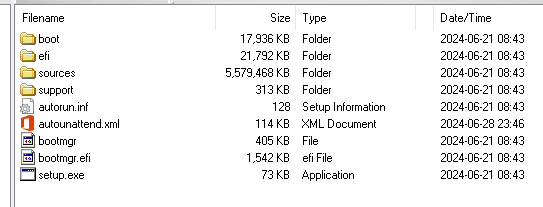

# Debloated Windows Unattend Installation

Welcome to my debloated Windows Installation! This modification basically removes all unneeded
Windows applications, providing you with a "blank canvas" to work with and install your own
programs.

## What does it do?

- **Bypasses Windows 11 System Requirements**:

  - Adds registry entries to bypass TPM, Secure Boot, Storage, CPU, RAM, and Disk checks.

- **Debloats Windows**:

  - Removes preinstalled bloatware apps using PowerShell scripts.
  - Removes legacy apps using PowerShell scripts.

- **Registry Tweaks**:

  - Disables Microsoft Account creation.
  - Disables User Account Control (UAC).
  - Disables lock screen and Windows Spotlight.
  - Customizes Start Menu and Taskbar settings.
  - Disables various Windows features like Cortana, Telemetry, Hibernation, and Location Tracking.
  - Configures Windows Update to only install security updates and delay other updates for 2 years.
  - Disables Windows Error Reporting, Delivery Optimization, and Remote Assistance.
  - Sets various performance and privacy-related registry keys.

- **Runs Custom Scripts**:

  - Executes PowerShell and batch scripts to apply additional tweaks and remove specific applications like Microsoft Edge, OneDrive, and Teams.
  - Loads and unloads the Default User registry hive to apply settings for new users.

- **Service Configurations**:

  - Sets numerous Windows services to manual or disabled to optimize performance.

- **Power Plan**:

  - Enables and sets the Ultimate Performance power plan as active.

- **Miscellaneous**:
  - Creates a desktop shortcut for Chris Titus Windows Utility.
  - Disables IPv6 and Teredo.
  - Disables various scheduled tasks related to telemetry and diagnostics.
  - Enables Dark Mode by default.
  - Aligns the Start Button in Windows 11 to the left by default.

> [!NOTE]
> Due to the removal of Microsoft Edge, I also include a Powershell Script on the Desktop called "LAUNCH-CTT-WINUTIL.ps1"

## How to create an ISO file

1. [Download the latest autounattend.xml.zip](https://nightly.link/sinjs/windows-unattend-install/workflows/build/master/autounattend.xml.zip)
2. [Download a Windows 10 or Windows 11 ISO](https://msdl.gravesoft.dev/)
3. Extract the autounattend.xml file
4. Open the ISO in any ISO editing program (Like [AnyBurn](https://www.anyburn.com/))
5. Add the file to the root of the disc:

   

## Installing it on your Computer

### Requirements

- USB Stick (8GB+)
- [Rufus](https://rufus.ie)
- The ISO file you created earlier

### Installing

1. Open rufus
2. Select the USB stick and ISO file
3. Click **`START`** (Your USB will be wiped)
4. Boot from the USB stick and continue installing Windows as usually

## Building the `autounattend.xml` yourself

### Requirements

> **WARNING:** Make sure you have minimum these versions installed, else it will not work!

- Node.js **`>=20.11`**
- pnpm **`>=9.1.0`**

### Building

```sh
pnpm install # Install dependencies
pnpm build # Build the autounattend.xml
```

You now have a `dist` folder with the `autounattend.xml` file inside of there.

## Credits

- Base Answer File generation:
  - [Schneegans Unattend Generator](https://schneegans.de/windows/unattend-generator/)
- Windows Tweaks & Optimizations:
  - [ChrisTitusTech WinUtil](https://github.com/ChrisTitusTech/winutil)
- Various Tweaks:
  - [Tiny11Builder](https://github.com/ntdevlabs/tiny11builder)
  - [Ten Forums](https://www.tenforums.com/)
  - [Eleven Forum](https://www.elevenforum.com/)
  - [Winaero Tweaker](https://winaerotweaker.com/)
  - [memstechtips](https://github.com/memstechtips)
